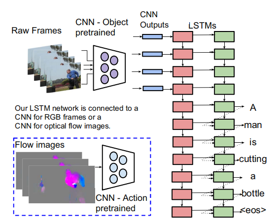
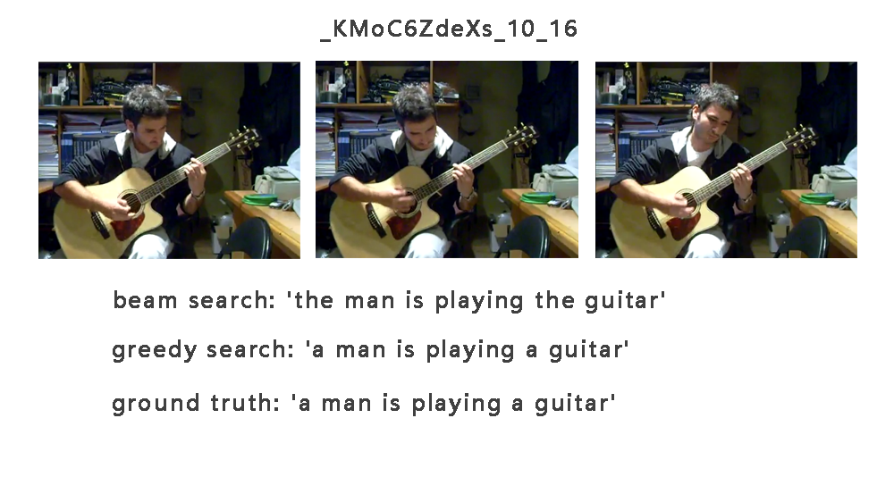
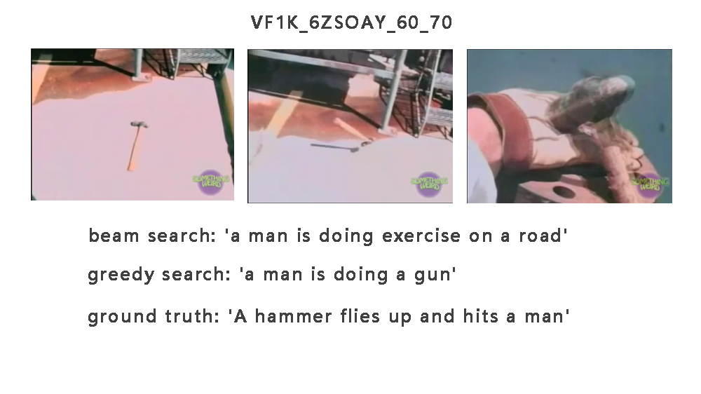
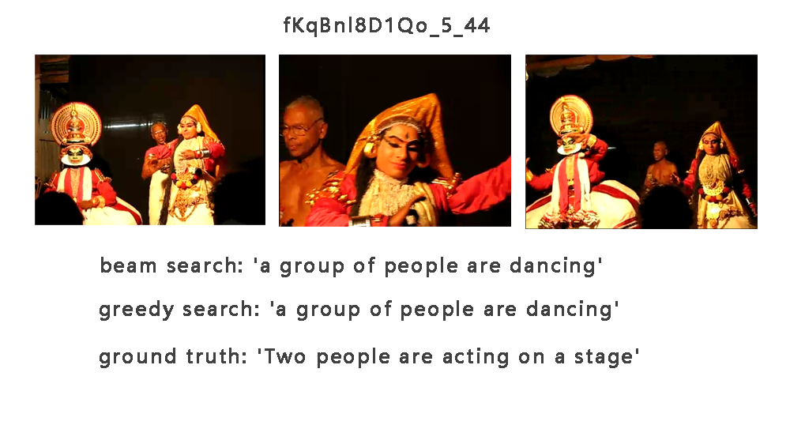
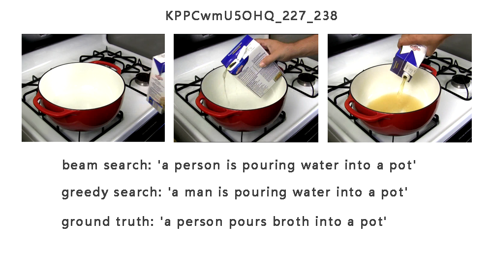
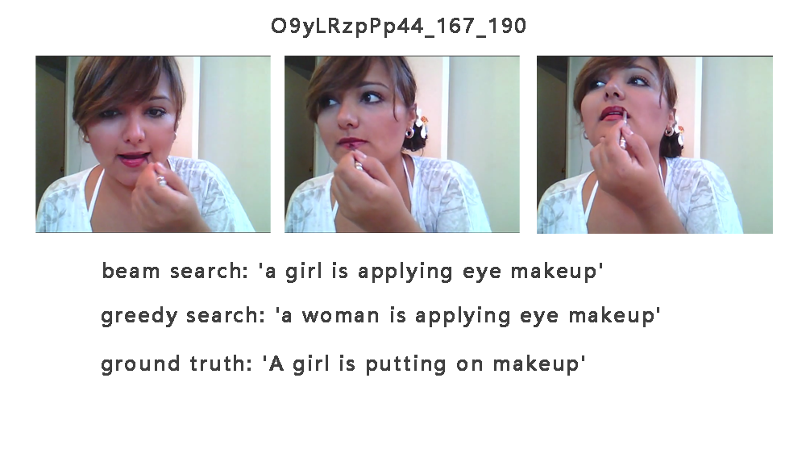
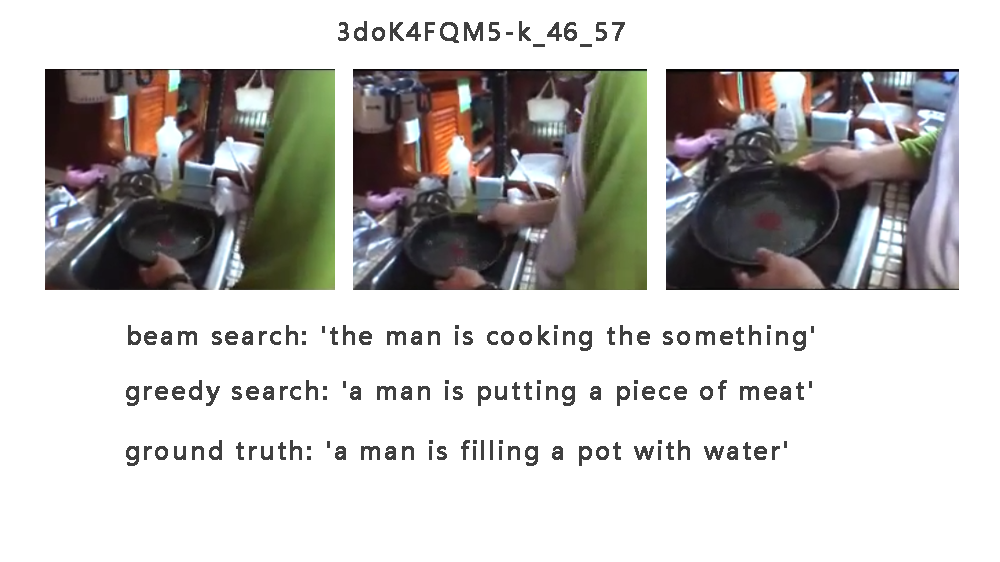

# S2VT-video-caption

[TOC]

The recurrence of paper "S.Venugopalan, M.Rohrbach, J.Donahue et. Sequence to Sequence – Video to Text. 2015, CVPR" [1505.00487 Sequence to Sequence -- Video to Text (arxiv.org)](https://arxiv.org/abs/1505.00487)

> This is the first deep learning repository I developed. If you have any questions, please contact me in the Issue. Because of my lack of knowledge, I may not be able to improve this project well. If you find any problems, welcome to submit a PR.
>
>  And I have a small blog site. [Kamino's Blog](https://blog.kamino.link/)

## Requirements

I use **Python 3.6** in this project. Recommend installing pytorch and python packages using Anaconda.

+ PyTorch
+ Numpy
+ tqdm
+ pretrainedmodels
+ tensorboardX
+ TensorFlow(if you want to use tensorboard)
+ ffmpeg (can install using anaconda)

## Data

+ MSVD 

  You can download the MSVD dataset here. [password s52p](https://pan.baidu.com/s/1-NcMX7TLHrm4wN8bnbED7w)

  Or you can directly download the features here. I use VGG16 with batch normalization. [password muph](https://pan.baidu.com/s/1aQw9OZ3U8g3RQ4RsmL74RQ)

  I have also tried Resnet152, VGG19, InceptionV4 and others. You can use `extract_features.py` to extract your own features.

  After download/extracted the features, change the path in `train.py`.

+ MSR-VTT

  Not support yet. BUT I plan to do that.

## Usage

1. **Install all the packages I mentioned**.

2. **Download the MSVD ~~or MSR-VTT~~ dataset.**

3. **Extract features**

   ```bash
   # You may need to make dir of feat_path. Check extract_features.py for more info.
   python extract_features.py --video_path ./data/YouTubeClips --feat_path ./data/feats/msvd_vgg16_bn --model vgg16_bn
   ```

4. **Prepare captions**

   Run `prepare_captions.py` . You may need to config the data path in the py file.

5. **Train**

   Run `train.py`. You can config all options in `class Opt()`.

6. **Test/Evaluate**

   Run `eval.py`. You can choose beam search or the common way.

   I provide ["Bleu_1",  "Bleu_2", "Bleu_3",  "Bleu_4", "METEOR", "ROUGE_L" ,"CIDEr"] metrics. I mainly focus on METEOR metric as the paper used this.

   > **The METEOR score** is computed based on the alignment between a given hypothesis sentence and a set of candidate reference sentences. METEOR compares exact token matches, stemmed tokens, paraphrase matches, as well as semantically similar matches using WordNet synonyms.

7. \***Check logs**

   You can find tensorboard logs in `./runs`. use `tensorboard --logdir=./runs` to check. The info include learning rate, loss and weights of each layer.

   You can also find  `.txt` file in `./checkpoint` , that is the config you use during the training.

## Model Description



This repo use S2VT model from paper mentioned above. The input feature can be Flow images but I didn't do that now. After feeding the features to a stack of two LSTM layers(Encoding stage), the model start to predict words one by one until meets `<eos>`(Decoding stage). The weight are shared between LSTM with same color.

You can find more in the paper.

## Result

| Model                  | Bleu1     | Bleu2     | Bleu3     | Bleu4     | METEOR   | ROUGE_L   | CIDEr     |
| ---------------------- | --------- | --------- | --------- | --------- | -------- | --------- | --------- |
| original paper         | N/A       | N/A       | N/A       | N/A       | 29.8     | N/A       | N/A       |
| **this repo**          | **0.754** | **0.614** | **0.507** | **0.402** | **30.1** | **0.665** | **0.536** |
| this repo(beam search) | 0.735     | 0.584     | 0.465     | 0.357     | 28.3     | 0.597     | 0.483     |

|  |  |
| --------------------- | --------------------- |
|    |    |
|    |    |

## Acknowledgement

Some codes are from these two repo.

[xiadingZ/video-caption.pytorch: pytorch implementation of video captioning (github.com)](https://github.com/xiadingZ/video-caption.pytorch)

[YiyongHuang/S2VT: S2VT pytorch implementation (github.com)](https://github.com/YiyongHuang/S2VT)

 Use metric code from [tylin/coco-caption (github.com)](https://github.com/tylin/coco-caption)

beam search modified from [PyTorch-Beam-Search-Decoding/decode_beam.py at master · budzianowski/PyTorch-Beam-Search-Decoding (github.com)](https://github.com/budzianowski/PyTorch-Beam-Search-Decoding/blob/master/decode_beam.py)

**Thanks to the computing power and resources provided by Communication University of China(CUC).**

**Thanks to my mentor and teammates for their guidance**


## TODO

+ MSR-VTT
+ evaluate direct from video

